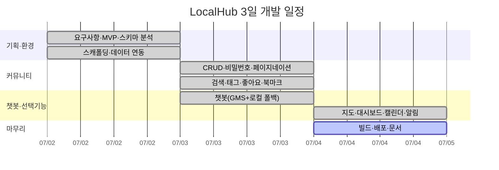

# LocalHub(서울) 개발 WBS + 간트 차트 (3일 집중 개발)

- **기간**: Day 1 ~ Day 3 (착수 2026-07-02 기준, 오전/오후 단위)
- **담당**: 1인 개발 기준 (`FE` 프론트, `DATA` 데이터, `DOC` 문서) — 팀 배분 시 열만 나눠 사용
- **상태 범례**: ✅ 완료 · 🔄 진행중 · ⬜ 예정
- **스프레드시트 산출물**: [`WBS_Gantt_LocalHub.xlsx`](WBS_Gantt_LocalHub.xlsx) (제공 템플릿 채운 버전)

---

## 1. WBS (Work Breakdown Structure)

| WBS ID | 대분류 | 작업 | 산출물 | 담당 | 예상(h) | 일자 | 상태 |
|--------|--------|------|--------|------|---------|------|------|
| 1.1 | 기획·설계 | 공문 분석 / 요구사항 정리 | MVP 정의서 | DOC | 2 | D1-AM | ✅ |
| 1.2 | 기획·설계 | 화면 흐름·라우팅 설계 | 화면 구성표 | FE | 1 | D1-AM | ✅ |
| 1.3 | 데이터 | 제공 JSON 스키마 분석 | 스키마 노트 | DATA | 1 | D1-AM | ✅ |
| 2.1 | 환경 구축 | Vite+Vue3+Router+Pinia 스캐폴딩 | 프로젝트 구조 | FE | 1 | D1-AM | ✅ |
| 2.2 | 데이터 | 서울 데이터 정규화 → public/data + manifest | 데이터셋/로더 | DATA | 2 | D1-PM | ✅ |
| 2.3 | 공통 UI | 전역 스타일/헤더/홈/푸터 | 앱 셸 | FE | 2 | D1-PM | ✅ |
| 3.1 | 커뮤니티 | 게시글 스토어(Pinia)+localStorage | posts 스토어 | FE | 2 | D2-AM | ✅ |
| 3.2 | 커뮤니티 | 목록/상세/작성/수정/삭제 화면 | 게시판 CRUD | FE | 3 | D2-AM | ✅ |
| 3.3 | 커뮤니티 | 비밀번호 모달·검증, 페이지네이션 | 권한 로직 | FE | 1.5 | D2-PM | ✅ |
| 3.4 | 커뮤니티 | 검색·태그·조회수·좋아요·북마크·공유 | 부가기능 | FE | 2 | D2-PM | ✅ |
| 4.1 | 챗봇 | GMS(OpenAI 호환) 서비스 + 로컬 RAG 검색 | 챗봇 서비스 | FE | 2 | D2-PM | ✅ |
| 4.2 | 챗봇 | 플로팅 위젯 UI(히스토리/모바일) | 챗봇 컴포넌트 | FE | 2 | D3-AM | ✅ |
| 5.1 | 선택기능 | 지도(Leaflet) POI 시각화·필터 | 지도 화면 | FE | 2 | D3-AM | ✅ |
| 5.2 | 선택기능 | 대시보드(Chart.js) 통계 3종 | 대시보드 | FE | 2 | D3-AM | ✅ |
| 5.3 | 선택기능 | 축제 캘린더 / 실시간 알림 | 캘린더·알림 | FE | 2 | D3-PM | ✅ |
| 6.1 | 마무리 | 빌드 검증·반응형·버그픽스 | 동작 확인 | FE | 1.5 | D3-PM | ✅ |
| 6.2 | 배포 | Netlify 배포 설정·URL 확인 | 배포 URL | FE | 1 | D3-PM | ⬜ |
| 6.3 | 문서 | 기능 명세서/WBS/README/발표자료 | 산출물 | DOC | 2 | D3-PM | 🔄 |
| | | | | **합계** | **≈36h** | | |

---

## 2. 간트 차트 (Gantt)

### 2.1 오전/오후 블록 뷰

| 작업 | D1 AM | D1 PM | D2 AM | D2 PM | D3 AM | D3 PM |
|------|:-----:|:-----:|:-----:|:-----:|:-----:|:-----:|
| 기획·설계·데이터 분석 | ██ | | | | | |
| 스캐폴딩·데이터 연동 | ░░ | ██ | | | | |
| 공통 UI(홈/헤더) | | ██ | | | | |
| 커뮤니티 CRUD | | | ██ | ░░ | | |
| 커뮤니티 부가기능 | | | | ██ | | |
| 챗봇(서비스+위젯) | | | | ██ | ██ | |
| 지도·대시보드 | | | | | ██ | ░░ |
| 캘린더·실시간 알림 | | | | | | ██ |
| 빌드·배포·문서 | | | | | | ██ |

> ██ 집중 작업 · ░░ 연계/마무리

### 2.2 Mermaid 간트 (지원 뷰어에서 렌더)

---

## 3. 마일스톤

| 마일스톤 | 완료 기준 | 목표 시점 | 상태 |
|----------|-----------|-----------|------|
| M1 — 데이터 연동 완료 | 서울 8종 로드 + 홈 렌더 | D1 종료 | ✅ |
| M2 — 커뮤니티 MVP | 서울 게시판 CRUD + 비밀번호 검증 | D2 종료 | ✅ |
| M3 — 챗봇 + 선택기능 | 챗봇 응답 + 지도/대시보드/캘린더 | D3 오전 | ✅ |
| M4 — 배포·산출물 제출 | Netlify URL + 문서 일체 | 납기(2026-07-16) | 🔄 |
